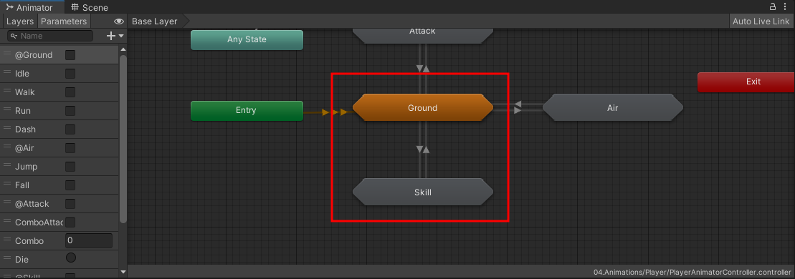
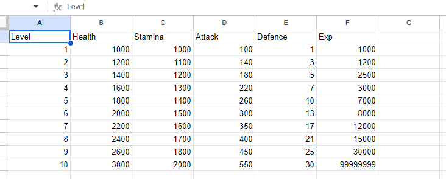
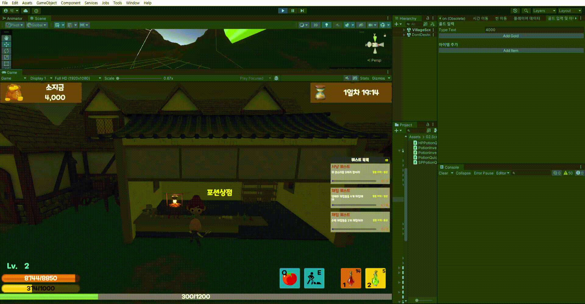

# 🐷 FindAieht 🐷
### 👨‍👧8조 김종욱, 박준형, 문원정, 김국민

<br><br>


## 🥥 프로젝트 결과물 소개 🥥

  

[**FindAieht 플레이 영상**](https://www.youtube.com/watch?v=OdmmBRaD1U4)

<br><br>

## 📜 프로젝트 개요 및 목표 📜​
> - **프로젝트 명 : Find Aieht**  
> - **장르 : 액션 RPG, 경영 시뮬레이션 타이쿤**  
> - **2D/3D : 3D**  
> - **스토리 라인**  
마을 식당을 운영하던 식당 주인이 키우던 동물   
Aieht이 어느날 알 수 없는 이유로 인해 사라져 버렸고,   
동시에 다른 가축들도 포악하게 변해버렸다.   
이로인해 가게 운영이 힘들어졌고,   
소중한 친구 Aieht을 찾기위해 마을 밖으로 나가게 되는데…  

<br><br>

## 📖 사용된 기술 스택 📖


<br><br>

## 🧩 클라이언트 구조 🧩


<br><br>


## 💥 주요 기능 구현

- 타이틀 화면
- 튜토리얼
- 플레이어
- 인벤토리 및 상점
- 강화 및 플레이어 정보
- 사냥터
- 타이쿤
- 던전
- 퀘스트
- 저장 및 로드

## 🎮 내가 했던 기능 구현

### 1. 플레이어 구현

#### 구현 및 이유

- FSM 디자인 패턴을 이용하여 플레이어를 구현함
- FSM 디자인 패턴을 채택한 이유는 플레이어가 상태마다 다양한 동작이 있으며, 상태 사이에도 여러 동작을 관리해야 하기 때문에 FSM 디자인 패턴을 사용했습니다.


#### 구현 방법

- 인터페이스와 추상클래스로 플레이어 상태 관리
```C#
public interface IState
{
    public void Enter();
    public void Exit();
    public void HandleInput();
    public void Update();
    public void PhysicsUpdate();
}

```

``` C#
public abstract class StateMachine
{
    protected IState currentState;

    public void ChangeState(IState state)
    {
        currentState?.Exit();

        currentState = state;

        currentState?.Enter();
    }   
}
```
</br>


- sub-statemachine을 이용하여 플레이어 애니메이션 관리함
    - 스킬 및 점프시에 애니메이션이 캔슬되지 않게끔 sub-statemachine으로 나눔  
     

</br>




- 구글 스프레드 시트를 이용한 플레이어 레벨시 증가하는 데이터 관리  
    - 플레이어의 레벨에 따라 스탯이 달라지는데, 이를 좀 더 유연하게 관리하기 위해 구글 스프레드시트를 사용

</br>




### 2. 포션 인벤토리

#### 구현 및 이유

- 인벤토리는 채집한 아이템을 담는 인벤토리와 포션만 담겨있는 인벤토리로 나눔
- 처음에는 포션과 인벤토리가 공존하는 인벤토리를 구현하였으나, 포션은 따로 관리하여 장착하는 형식은 어떻냐고 기획부분에서 의견이 나와서 포션은 장착하는 형식, 그리고 기존 인벤토리는 채집물을 담는 형식으로 구현했음
- 상점 구현을 맡았는데, 상점에서 포션을 사는 것과 연결 지을 수 있기 때문에 포션 인벤토리를 구현하게 됨

#### 구현 방법

- 포션 인벤토리는 HP포션 3개, SP포션 3개 총 6개로 고정이기 때문에 비용이 비교적 싼 배열로 생성
- 포션 인벤토리 베이스를 생성하여 이를 상속받아 HP포션과 SP포션을 구현함
- Onclick 이벤트로 포션을 클릭했을 때 해당 포션이 퀵슬롯에 장착되게끔 구현함

</br>


### 3. 상점 구현

#### 구현 및 이유

- 기존 기획은 채집한 물건을 파는 것이 아닌 오로지 타이쿤으로만 골드를 벌 수 있고, 번 골드로 포션을 사는 식의 상점을 구현했음
- 그러나 타이쿤보다 사냥 위주로 하는 사람도 있다고 생각이 들었기도 하고, 타이쿤을 어려워할 수 도 있다고 생각하여 인벤토리의 아이템을 팔 수 있게끔 구현하기로 결정함
- 그리고 상점에서는 포션만 팔게끔 구현함

#### 구현 방법

- 상점에서 구매할 시에 구매할 포션은 마찬가지로 총 6개이기 때문에 리스트가 아닌 배열로 구현
- 슬라이드를 이용하여 포션의 수량을 늘릴 수 있고, 뿐만 아니라 양 옆의 화살표로 +- 를 할 수 있게끔 구현함
- 포션을 구매하면 바로 수량이 늘어나는 식으로 구현하였으며, 만약 골드가 부족할 경우 UI를 붉은색으로 변하게 하여 구매할 수 없게끔 구현하였음

```C#
 private void OnSliderValueChanged(float newValue)
 {
     _itemCurQuantity = Mathf.RoundToInt(newValue); 
     int totalItemGold = _itemCurQuantity * _itemCurGold;

     _itemQuantity.text = _itemCurQuantity.ToString();
     _itemPrice.text = totalItemGold.ToString();

     if (totalItemGold > _playerData.PlayerData.PlayerGold)
     {
         _itemPrice.color = Color.red;
     }
     else
     {
         _itemPrice.color = Color.black;
     }
 }

```

</br>




### 4. 퀘스트

#### 구현 및 이유

- 중간 점검 이후 게임 사이클을 완성했으나 플레이어에게 플레이하는데 있어 목적성과 소정의 보상이 필요하다고 생각이 듦
- 일일 퀘스트나 업적 등이 게임내에 있다면 플레이어 입장에서 목표가 생기기 때문에 더 몰입할 수 있다고 판단하여 추가하게 됨

#### 구현 방법

- 디자인 패턴을 사용하려 했으나 싱글 플레이 게임이기도 하고 가독성을 고려해서 퀘스트 매니저로 퀘스트의 생성, 진행 상황, 완료를 관리하면 좋겠다고 생각하여 이러한 방식을 채택하게됨
- 일일 퀘스트는 게임 내 세계 시간을 관리하는 매니저에 이벤트를 줘서 날짜가 변경될 때 마다 퀘스트가 새로 생성되는 형식으로 구현
- 업적의 경우 튜토리얼이 지나면 알아서 수락되게끔 구현하였고, 일일 퀘스트는 상위 퀘스트 클래스를 상속받아서 랜덤한 퀘스트를 일차마다 생성하게끔 구현함

</br>


## ⚠ 트러블 슈팅

- 💥 트러블 슈팅 1 - 게임 저장/불러오기 에서 Dictionary로 불러와야하는 상황이 발생

        📌 JsonConvert 클래스를 이용해 불러오기를 시도, Get Set함수를 이용하여 데이터를 주고 받다 보니 데이터가 null로 들어옴

        ☑️ 이를 프로퍼티로 변경하니 해결됨

        💡 JsonUtility는 상관없었으나, JsonConvert는 private일 경우 프로퍼티로 주고받아야 하는것을 알게됨

- 💥 트러블 슈팅 2 - 플레이어가 스킬중에는 캔슬없이 모션이 다 나가야 할 필요가 있다고 생각이 듦

        📌 기존에 애니메이션에서 sub-statemachine으로 분류하여 사용

        📌 ground에 skill과 walk등 모든 상태를 ground내에서 관리하여 상황이 발생함

        💡 그래서 Skill이라는 sub-statemachine으로 따로 빼서 관리를 해주니 스킬중 캔슬되는 현상이 해결됨

- 💥트러블 슈팅 3 - 코루틴이 작동하지 않는 문제 발생

        📌 플레이어가 로딩 중에 간헐적으로 비활성화 코루틴이 비활성화 됨

        📌 쿨타임을 관리해주는 매니저를 따로 만들어서 관리해줌

        ☑️ 씬이 넘어갈 때 매니저는 계속 활성화되어있기 때문에 문제가 해결됨

        💡 이벤트를 매개변수로 전달받아서 해결할 수 있었음

- 💥트러블 슈팅 4 - 퀵슬롯 포션이 로드시에 수치가 변경되지 않던 문제

        📌 로드시에는 인벤토리를 활성화하기 이전에 퀵슬롯이 등록되어 있기 때문에 문제가 생김

        💡 퀵슬롯을 관리하는 스크립트의 Start부분으로 이벤트를 옮겨서 해결함


## ☕ 회고

최종 프로젝트를 마무리하면서 다사다난했지만 최적화와 배포를 해봤다는 점 그리고 유저 피드백을 받고 수정까지 해본 경험이 정말 귀한 경험이었고, 아쉬웠던 점은 플레이어가 공격할 때 타격감이나 다양한 기능들을 넣지 못했다는 점이 아쉬웠고, 그리고 초반 기획에서 엎어진 부분이 많은데 기획 또는 개발을 더 탄탄하게 해서 개발하면 좋았을 것 같다는 생각이 들었다.

